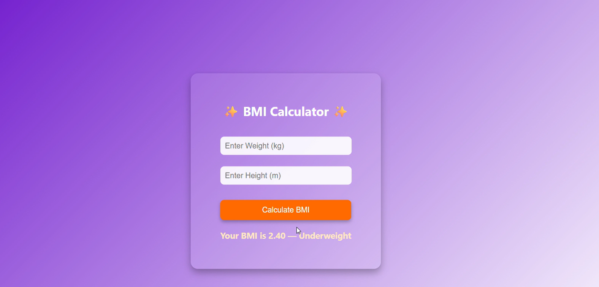

# ⚖️ OIBSIP_Python_Programming_Task2 – BMI Calculator

## 🔍 Objective:
To build a Body Mass Index (BMI) Calculator using **Python and Flask**, where users can input their height and weight, and receive their BMI value along with a health category.

---

## ⚙️ Tools Used:
- Python 3
- Flask (web framework)
- HTML/CSS
- Visual Studio Code (VS Code)

---

## 📝 Features:
- Input form for height (in cm) and weight (in kg)
- Calculates BMI using the formula:  
  \[ BMI = weight / (height in meters)^2 \]
- Classifies result into:
  - Underweight
  - Normal
  - Overweight
  - Obese
- Simple, clean UI with Flask and HTML

---

## ▶️ How to Run the Project in VS Code:

### 🔹 Step 1: Open Folder in VS Code
Open the project folder `OIBSIP_Python_Programming_Task2` in Visual Studio Code.

### 🔹 Step 2: Install Flask
Open the **terminal** inside VS Code (View > Terminal), and run:
```bash
pip install flask
🔹 Step 3: Run the App
In the same terminal:

bash
Copy
Edit
python app.py
🔹 Step 4: Open in Browser
Go to:

cpp
Copy
Edit
http://127.0.0.1:5000
📸 Screenshots:
🔹 Web App Interface

🔹 Terminal Output in VS Code

✅ Outcome:
A simple and interactive BMI calculator web app that helps users check their fitness level based on weight and height inputs.

📁 Folder Structure:
pgsql
Copy
Edit
OIBSIP_Python_Programming_Task2/
├── app.py
├── templates/
│   └── index.html
├── bmi_calculator_ui.png
├── bmi_flask_server_output.png
└── README.md
🧑‍💻 Author:
Pavani Chalapadi
Python Programming Intern – Oasis Infobyte (OIBSIP)

#OasisInfobyte #PythonProgramming #BMIcalculator #FlaskApp #Internship #LearningByDoing
